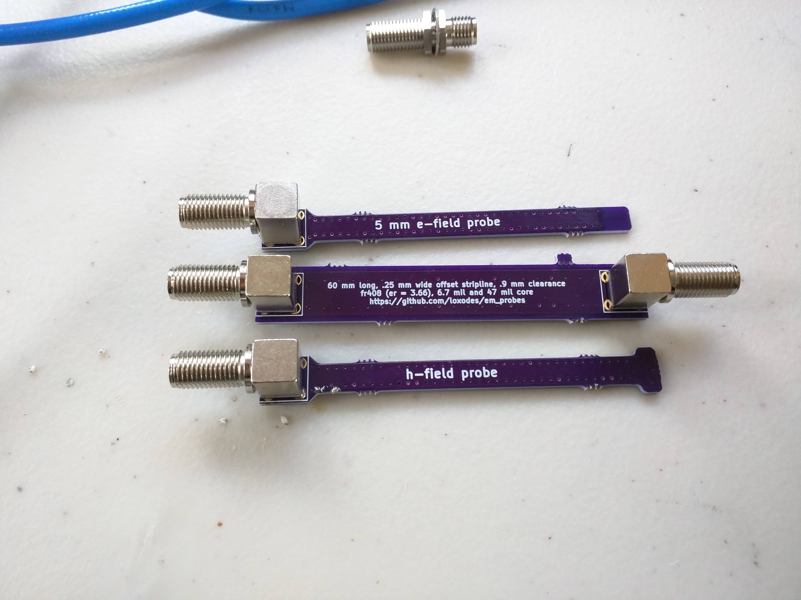

# em_probes
experimental open hardware near field e-field and h-field probes

See doc folder for scalar network analyzer captures of probe performance.

h-field probe design from "Study of Magnetic Probes Used in EMI Measurements", DOI 10.1109/APEMC.2015.7175309

