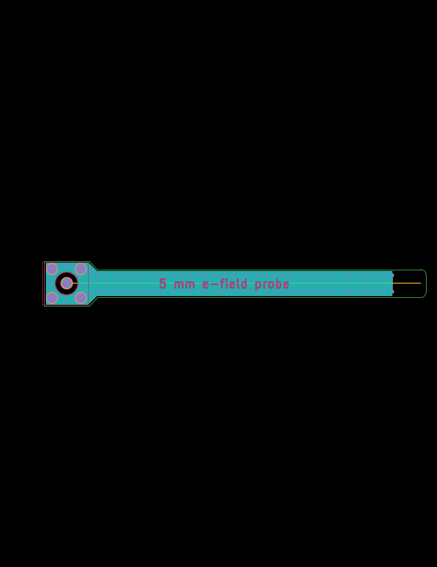
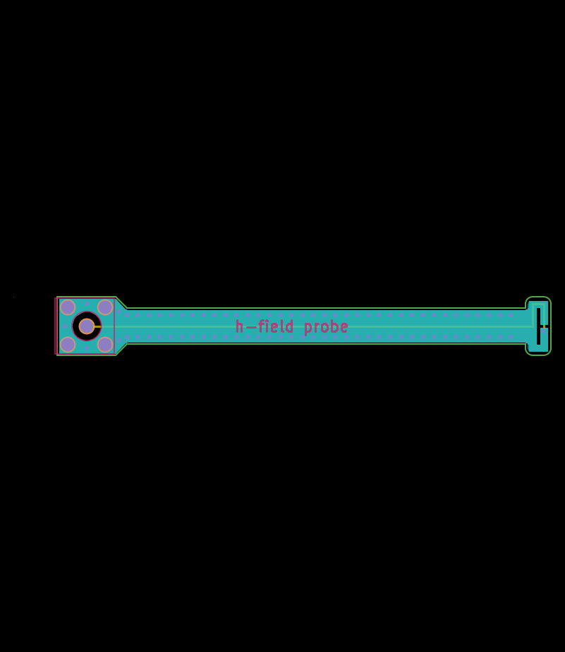

# em_probes
experimental open hardware near field e-field and h-field probes

the probes are untested and unsimulated so far..

h-field probe design from "Study of Magnetic Probes Used in EMI Measurements", DOI 10.1109/APEMC.2015.7175309

